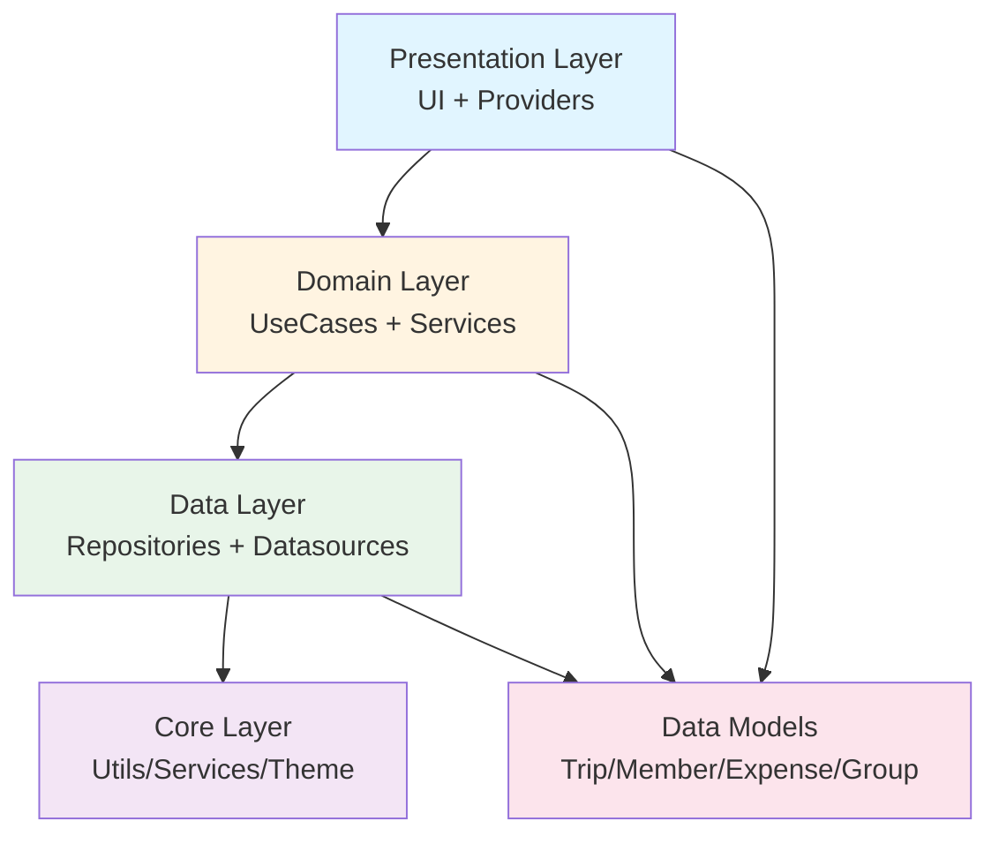

# AI 旅行账本 — 代码结构图（PM 起草）

**版本**: v0.2
**日期**: 2026-06-28
**作者**: PM（主 Agent）

---

## 一、目录树（完整 lib/ 结构）

```
lib/
├── main.dart                              # 入口
├── app.dart                               # 根 Widget
│
├── core/                                  # 核心工具
│   ├── constants/
│   │   ├── app_colors.dart                # 主题颜色
│   │   ├── app_strings.dart               # 文案常量
│   │   └── expense_categories.dart        # 10 个费用类别定义
│   ├── errors/
│   │   ├── app_exception.dart             # 自定义异常
│   │   └── error_handler.dart             # 全局错误处理
│   ├── utils/
│   │   ├── currency_formatter.dart        # 金额格式化 ¥1,234.56
│   │   ├── date_formatter.dart            # 日期格式化
│   │   ├── uuid_generator.dart            # UUID 生成
│   │   └── validators.dart                # 输入校验
│   ├── extensions/
│   │   └── datetime_extensions.dart       # DateTime 扩展
│   ├── services/
│   │   ├── storage_service.dart           # Hive 封装
│   │   ├── supabase_service.dart          # Supabase 客户端
│   │   ├── image_compressor.dart          # 图片压缩
│   │   ├── qr_generator.dart              # 二维码生成
│   │   └── share_service.dart             # 分享到微信
│   ├── router/
│   │   └── app_router.dart                # go_router 配置
│   └── theme/
│       ├── app_theme.dart                 # Material 3 主题
│       └── text_styles.dart               # 文本样式
│
├── data/                                  # 数据层
│   ├── models/                            # 数据模型（Hive TypeAdapter）
│   │   ├── trip.dart                      # 旅程
│   │   ├── trip.g.dart                    # build_runner 生成
│   │   ├── member.dart                    # 成员
│   │   ├── member.g.dart
│   │   ├── group.dart                     # 组 🆕
│   │   ├── group.g.dart
│   │   ├── expense.dart                   # 账目
│   │   ├── expense.g.dart
│   │   ├── split_rule.dart                # 分摊规则
│   │   ├── split_rule.g.dart
│   │   ├── settlement.dart                # 结算单
│   │   ├── settlement.g.dart
│   │   └── enums.dart                     # 所有枚举
│   ├── datasources/
│   │   ├── local/
│   │   │   ├── hive_datasource.dart       # Hive 封装
│   │   │   └── hive_init.dart             # 初始化
│   │   └── remote/
│   │       └── supabase_datasource.dart   # Supabase RPC
│   ├── repositories/                      # 仓库（业务逻辑入口）
│   │   ├── trip_repository.dart           # 旅程 CRUD + 状态
│   │   ├── member_repository.dart         # 成员 CRUD
│   │   ├── group_repository.dart          # 组 CRUD 🆕
│   │   ├── expense_repository.dart        # 账目 CRUD + 重复检测
│   │   ├── settlement_repository.dart     # 结算 CRUD
│   │   └── sync_repository.dart           # 离线同步
│   └── sync/
│       ├── sync_manager.dart              # 同步协调器
│       └── conflict_resolver.dart         # 冲突解决
│
├── domain/                                # 业务逻辑层（纯函数）
│   ├── usecases/
│   │   ├── create_trip_usecase.dart       # 创建旅程
│   │   ├── add_member_usecase.dart        # 添加成员
│   │   ├── create_group_usecase.dart      # 创建组
│   │   ├── add_expense_usecase.dart       # 记账
│   │   ├── calculate_settlement_usecase.dart  # 结算
│   │   └── approve_expense_usecase.dart   # 重复账目确认
│   └── services/                          # 领域服务（算法核心）
│       ├── settlement_engine.dart         # 结算引擎（贪心）
│       ├── split_calculator.dart          # 分摊计算（4 种）
│       ├── duplicate_detector.dart        # 重复检测
│       ├── invitation_service.dart        # 邀请链接生成
│       └── statistics_service.dart        # 统计（总花费/人均）
│
├── presentation/                          # UI 层
│   ├── providers/                         # Riverpod 状态管理
│   │   ├── trip_provider.dart            # 旅程列表/详情
│   │   ├── member_provider.dart           # 成员管理
│   │   ├── group_provider.dart            # 组管理 🆕
│   │   ├── expense_provider.dart          # 账目列表/创建
│   │   ├── settlement_provider.dart       # 结算单
│   │   └── settings_provider.dart         # 用户设置
│   ├── screens/
│   │   ├── trips/
│   │   │   ├── trip_list_screen.dart      # 旅程列表（首页）
│   │   │   ├── trip_create_screen.dart    # 创建旅程
│   │   │   ├── trip_detail_screen.dart    # 旅程详情（Dashboard）
│   │   │   ├── trip_settings_screen.dart  # 旅程设置
│   │   │   └── invite_screen.dart         # 邀请页
│   │   ├── members/
│   │   │   ├── member_manage_screen.dart  # 成员管理
│   │   │   └── join_trip_screen.dart      # 加入旅程
│   │   ├── groups/
│   │   │   ├── group_manage_screen.dart   # 组管理 🆕
│   │   │   └── group_create_screen.dart   # 创建组 🆕
│   │   ├── expenses/
│   │   │   ├── expense_list_screen.dart   # 账目列表
│   │   │   ├── expense_create_screen.dart # 记账（核心）
│   │   │   ├── expense_detail_screen.dart # 账目详情
│   │   │   └── expense_approval_screen.dart  # 重复确认 🆕
│   │   ├── settlement/
│   │   │   ├── settlement_screen.dart     # 结算单
│   │   │   └── settlement_share_screen.dart  # 分享结算单
│   │   ├── statistics/
│   │   │   └── statistics_screen.dart     # 统计页（饼图+柱状图）
│   │   └── settings/
│   │       ├── settings_screen.dart       # 设置
│   │       └── ai_settings_screen.dart    # AI 模型配置
│   ├── widgets/                           # 通用组件
│   │   ├── amount_input.dart              # 金额输入框
│   │   ├── category_chip.dart             # 类别 Chip
│   │   ├── member_avatar.dart             # 成员头像
│   │   ├── group_chip.dart                # 组 Chip 🆕
│   │   ├── expense_card.dart              # 账目卡片
│   │   ├── split_type_selector.dart       # 分摊类型选择器
│   │   ├── split_preview.dart             # 分摊预览
│   │   ├── settlement_summary.dart        # 结算摘要
│   │   ├── empty_state.dart               # 空状态
│   │   ├── loading_indicator.dart         # 加载
│   │   ├── error_retry.dart               # 错误重试
│   │   ├── attachment_grid.dart           # 附件网格
│   │   ├── compress_indicator.dart        # 压缩进度
│   │   ├── qr_code_widget.dart            # 二维码显示
│   │   └── model_selector.dart            # 模型选择器
│   └── theme/
│       ├── app_colors.dart
│       └── text_styles.dart
│
└── routes/
    └── app_router.dart                    # go_router 配置
```

**文件总数**: 67 个

---

## 二、模块依赖图（Mermaid）



---

## 三、分层架构说明

### 3.1 数据流向

```
[用户操作]
  ↓
[Presentation: Widget + Provider]
  ↓ trigger
[Domain: UseCase] ← 业务逻辑入口
  ↓ call
[Data: Repository]
  ├─→ [Local: Hive] ← 立即写入（离线优先）
  └─→ [Remote: Supabase] ← 异步同步
  ↓
[Models: Trip/Expense/...]
  ↓ return
[Presentation: UI 更新]
```

### 3.2 关键模块职责

| 模块 | 职责 | 依赖 |
|---|---|---|
| **SettlementEngine** | 结算算法（贪心+按组）| Models |
| **SplitCalculator** | 4 种分摊计算 | Models |
| **DuplicateDetector** | 重复检测 | Models |
| **ImageCompressor** | 图片压缩 | image 包 |
| **ExpenseRepository** | 账目 CRUD + 重复检测 | Hive + DuplicateDetector |
| **SettlementRepository** | 结算 CRUD + 算法 | Hive + SettlementEngine |
| **SyncManager** | 离线/在线同步 | Supabase + Hive |

---

## 四、Riverpod 状态管理层次

```
App Providers
├── DatabaseProvider (Hive 初始化)
├── SupabaseProvider (Supabase 客户端)
├── AuthProvider (匿名登录)
└── SettingsProvider (用户偏好)
    └── Feature Providers
        ├── TripListProvider (旅程列表)
        ├── TripDetailProvider (单个旅程详情)
        ├── MemberListProvider (成员)
        ├── GroupListProvider (组) 🆕
        ├── ExpenseListProvider (账目)
        └── SettlementProvider (结算)
```

---

## 五、关键 API 设计

### 5.1 Repository 接口（示例）

```dart
abstract class ExpenseRepository {
  Future<List<Expense>> getByTrip(String tripId);
  Future<Expense> add(Expense expense);
  Future<void> delete(String id);
  Future<void> update(Expense expense);
  Future<List<Expense>> getDuplicates(Expense expense);
  Future<void> approve(String id);
  Stream<List<Expense>> watchByTrip(String tripId);
}
```

### 5.2 UseCase 接口（示例）

```dart
class AddExpenseUseCase {
  final ExpenseRepository _repo;
  final DuplicateDetector _detector;

  AddExpenseUseCase(this._repo, this._detector);

  Future<AddExpenseResult> execute(Expense expense) async {
    // 1. 检测重复
    final isDuplicate = await _detector.isDuplicate(expense);

    if (isDuplicate) {
      // 标记为 unconfirmed
      expense.approvalStatus = ApprovalStatus.unconfirmed;
    } else {
      expense.approvalStatus = ApprovalStatus.confirmed;
    }

    // 2. 保存
    final saved = await _repo.add(expense);

    // 3. 异步同步
    unawaited(_syncToCloud(saved));

    return AddExpenseResult(
      expense: saved,
      isDuplicate: isDuplicate,
    );
  }
}
```

---

## 六、UI 界面清单（27 个屏幕）

| 屏幕 | 路由 | 用途 |
|---|---|---|
| `TripListScreen` | `/trips` | 旅程列表（首页）|
| `TripCreateScreen` | `/trips/new` | 创建旅程 |
| `TripDetailScreen` | `/trips/:id` | 旅程 Dashboard |
| `TripSettingsScreen` | `/trips/:id/settings` | 旅程设置 |
| `InviteScreen` | `/trips/:id/invite` | 邀请页 |
| `JoinTripScreen` | `/join/:token` | 加入旅程 |
| `MemberManageScreen` | `/trips/:id/members` | 成员管理 |
| `GroupManageScreen` | `/trips/:id/groups` | 组管理 🆕 |
| `GroupCreateScreen` | `/trips/:id/groups/new` | 创建组 🆕 |
| `ExpenseListScreen` | `/trips/:id/expenses` | 账目列表 |
| `ExpenseCreateScreen` | `/trips/:id/expenses/new` | 记账 |
| `ExpenseDetailScreen` | `/trips/:id/expenses/:eid` | 账目详情 |
| `ExpenseApprovalScreen` | `/trips/:id/expenses/approval` | 重复确认 🆕 |
| `SettlementScreen` | `/trips/:id/settlement` | 结算单 |
| `SettlementShareScreen` | `/trips/:id/settlement/share` | 分享结算单 |
| `StatisticsScreen` | `/trips/:id/stats` | 统计 |
| `SettingsScreen` | `/settings` | 设置 |
| `AISettingsScreen` | `/settings/ai` | AI 配置 |

**核心屏幕 6 个**（高亮加粗）：
- **TripListScreen**（首页）
- **TripDetailScreen**（旅程详情）
- **ExpenseCreateScreen**（记账）
- **ExpenseListScreen**（账目列表）
- **SettlementScreen**（结算单）
- **MemberManageScreen**（成员管理）

---

## 七、第三方依赖（pubspec.yaml 草案）

```yaml
dependencies:
  flutter:
    sdk: flutter

  # 状态管理 + 路由
  flutter_riverpod: ^2.4.0
  go_router: ^13.0.0

  # 数据
  hive: ^2.2.3
  hive_flutter: ^1.1.0
  supabase_flutter: ^2.0.0

  # 工具
  intl: ^0.19.0
  uuid: ^4.0.0

  # 图片
  image_picker: ^1.0.0
  image: ^4.1.0
  flutter_image_compress: ^2.2.0

  # 分享
  share_plus: ^9.0.0
  qr_flutter: ^4.1.0

  # 图表
  fl_chart: ^0.65.0

  # AI
  http: ^1.1.0  # 调用 OpenAI 兼容 API

dev_dependencies:
  flutter_test:
    sdk: flutter
  build_runner: ^2.4.0
  hive_generator: ^2.0.0
  flutter_lints: ^3.0.0
```

---

## 八、开发里程碑

| Phase | 内容 | 预计 |
|---|---|---|
| **Phase 1** | 数据模型 + Repository + 结算引擎 + Hive + 单元测试 | 2h |
| **Phase 2** | UI 页面（18 个屏幕）+ Riverpod + go_router + 动画 | 3h |
| **Phase 3** | Supabase 同步 + 重复检测 + 图片压缩 + E2E | 2h |

---

*本文档为代码结构蓝图，具体实现由 dev Agent 完成*
